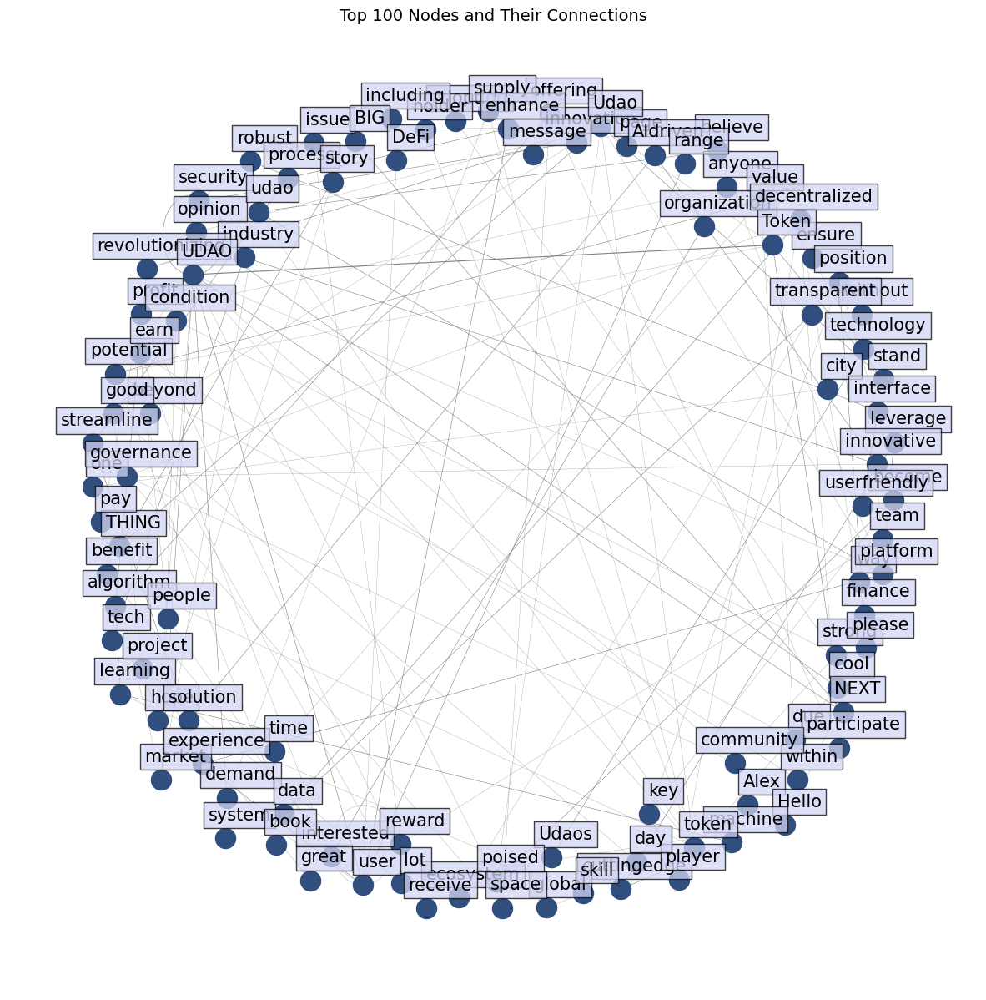

# Campus Intelligent Web3 Ecosystem - Exploring Motivation Gaps and Web3 Incentives in Learning Communities
Duke Kunshan University Signature Work 2025

## Abstract

## Background
Motivation is a cornerstone of successful learning, yet many traditional online learning communities struggle to sustain learner engagement. Platforms like Study Together, one of the largest study and productivity communities on Discord, highlight this challenge. Through its #motivation channel, users share their learning experiences, challenges, and strategies, revealing gaps in motivation and the need for more effective incentive mechanisms.

Meanwhile, Web3 technologies offer innovative solutions for education, combining blockchain-based incentives with decentralized skill certification. A notable example is UDAO, a Web3 learning platform launched in June, 2024 by experts from ETH Zurich. UDAO integrates ERC-20 tokens for gamified learning rewards, blockchain-based skill validation, and a community-driven governance model. Its design shares similarities with Metaversity, a metaverse-enabled smart campus concept. However, the effectiveness of UDAO’s incentive mechanisms remains underexplored.

This study aims to identify motivational gaps in traditional learning communities and evaluate the potential of Web3 platforms like UDAO to address these challenges, providing insights for designing improved incentive systems.

## Research Questions

- **RQ1:** What are the key motivational challenges faced by users in traditional learning communities such as Study Together?
- **RQ2:** How can UDAO’s Web3 incentive mechanisms effectively address these challenges?

## Data

### **Meta Data Information**

**1. UDAO Daily Data**
The first dataset consists of daily price and volume data for the UDAO token, downloaded directly from CoinMarketCap. The dataset includes fields such as opening price, closing price, daily high, daily low, trading volume, and timestamp. It provides a comprehensive view of UDAO's market performance and was retrieved from the official UDAO page on CoinMarketCap: *https://coinmarketcap.com/currencies/udao/*.

**2. User Messages from Discord Channels**
The second dataset comprises user messages extracted from two Discord channels.The data was collected using the open-source tool DiscordExplorer: *https://github.com/mdawsonuk/DiscordExplorer*. This dataset includes message content, timestamps, and user sentiment, enabling both sentiment and topic analysis.
- The #motivation channel in the Study Together Discord community, focusing on discussions about learning motivation and challenges.
- The #suggestion channel in the UDAO Official Discord server, where users provide feedback and suggestions regarding the UDAO platform. 

### **Data Dictionary**

#### **Dataset 1: UDAO Daily Market Data**

| **Variable Name**  | **Description**                                           | **Frequency** | **Unit**         | **Type**      |
|---------------------|-----------------------------------------------------------|---------------|------------------|---------------|
| Name               | The identifier for the dataset entry                      | Daily         | Numeric          | Identifier    |
| Open               | The opening price of UDAO for the day                     | Daily         | USD              | Numeric       |
| High               | The highest price of UDAO for the day                     | Daily         | USD              | Numeric       |
| Low                | The lowest price of UDAO for the day                      | Daily         | USD              | Numeric       |
| Close              | The closing price of UDAO for the day                     | Daily         | USD              | Numeric       |
| Volume             | The total trading volume of UDAO for the day              | Daily         | USD              | Numeric       |
| MarketCap          | The market capitalization of UDAO for the day             | Daily         | USD              | Numeric       |
| Timestamp          | The date and time the record was logged                   | Daily         | ISO8601 Timestamp| Timestamp     |

---

#### **Dataset 2: User Messages from Discord Channels**

| **Variable Name**  | **Description**                                           | **Frequency** | **Unit**         | **Type**      |
|---------------------|-----------------------------------------------------------|---------------|------------------|---------------|
| AuthorID           | The unique identifier of the message author               | Per message   | Numeric ID       | Identifier    |
| Author             | The username of the message author                        | Per message   | String           | Categorical   |
| Date               | The date and time the message was posted                  | Per message   | ISO8601 Timestamp| Timestamp     |
| Content            | The textual content of the message                        | Per message   | Text             | Text          |
| Attachments        | Any attachments included in the message                   | Per message   | File Links       | Text          |
| Reactions          | Emoji reactions to the message, including counts          | Per message   | Emoji + Count    | Categorical   |

## Code

### **Code Description**

| **Section**              | **Description**                                                                                                    |
|--------------------------|--------------------------------------------------------------------------------------------------------------------|
| **Price**   | Calculates representative prices, daily percentage changes, and visualizes price trends and trading volumes.      |
| **Data Loading and Cleaning**   | Processes message content, timestamps, and reactions for sentiment and topic modeling.                            |
| **UDAO Suggestion**       | - Word Frequency Analysis.                                                   |
|                          | - Topic Analysis.                                         |
|                          | - Network Analysis.                                           |
| **Study Together Motivation**       | - Word Frequency Analysis.                                                   |
|                          | - Topic Analysis.                                         |
|                          | - Network Analysis.                                           |

## Result

### Study Together Community Motivation

  

  <em>Figure 1: Word Frequency in Study Together.</em>

  

  <em>Figure 2: Topic Analysis in Study Together.</em>

  

  <em>Figure 3: Network Analysis in Study Together.</em>

### UDAO Community Tokenomics

  

  <em>Figure 4: UDAO Token Daily Representative Price Trend.</em>

  

  <em>Figure 5: UDAO Token Trading Volume Trend.</em>

  

  <em>Figure 6: UDAO Token Daily Percentage Change Distribution.</em>

### UDAO Community Suggestion

  

  <em>Figure 7: Word Frequency in UDAO.</em>

  

  <em>Figure 8: Topic Analysis in UDAO.</em>

  

  <em>Figure 9: Network Analysis in UDAO.</em>

## Author Information 
- **Author:** Xintong Wu, majoring in Computation and Design/ Computer Science, Duke Kunshan University, Class of 2025.
- **Mentors:** Prof. Luyao Zhang, Duke Kunshan University.

## Resources

